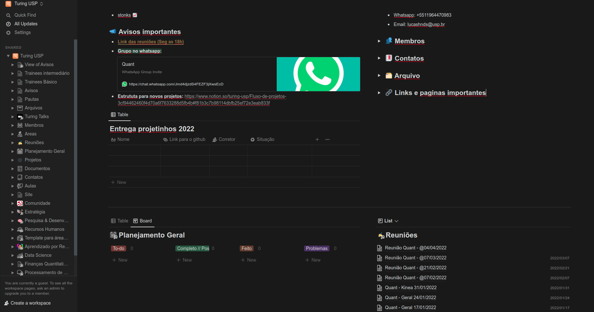

# Estudo guiado de finanças quantitativas

Bem vindo ao projetinho do Turing Quant!


Neste notebook você aprenderá os seguinte assuntos:

- Importação e visualização de dados financeiros
- Retornos e Risco (Volatilidade)
- Análise de portfólios
- Predição de Series Temporais

Alem do código você tambem precisa escrever um Turing Talks sobre algum tema relacionado a finanças, que deve virar uma aulinha interna para area de Quant! Mais adiante damos algumas sujestões de temas. E alias, o Turing Talks pode ser individual, dupla, trio, etc. Entao é bem tranquilo.

## Instalação

Crie um ambiente virtual
```
$ virtualenv .quantenv
```

Instale os requirements

```
wget https://gist.githubusercontent.com/lhndsp/470a2998d44f433aa71f002315c8e42f/raw/e2a519a46e71c462ac05b5c2678d51b74938e2a1/requirements.txt
```

```
$ pip install -r requirements.txt
```

Adicione o ambiente virtual a sua base de kernels do jupyter notebook

```
$ python -m ipykernel install --user --name=.quantenv
```

Após executar esse comando espera-se um resultado como o seguinte:

```
Installed kernelspec .quantenv in /home/<user>/.local/share/jupyter/kernels/.quantenv
```

Ative o ambiente virtual

```
$ source .quantenv/bin/activate
```

Inicie o Jupyter Notebook

```
$ jupyter notebook
```

**Obs:** Não esqueça de alterar o kernel para .quantenv

## Entrega

Aconselhamos que você faça tanto as atividades quanto o turing talks em jupyter notebooks (Não precisa converter pra o TT para pdf). 
Crie um repo no seu github ([temos uma aulinha com o basico de git](https://drive.google.com/drive/u/1/folders/1OWy4Fgo8AcJsrGrbjRLoWXrXDikJPq9j)) 
Na pagina inicial de Quant no [Notion](https://www.notion.so/turing-usp/e2470fb4d24d4c3181054eea07ad8558?v=b15158b9b08b4558a066d99a2f827dc8) tem um espaço para entregar os projetos, é só colocar seu nome e link para o repo github nos espaços indicados. 
Caso o TT tenha sido feito em grupo, podem subir para um unico repo (ou para o de todos se quiserem), só deixar no inicio do texto que são os autores.



E uma observação importante, caso você instale algum pacote que nao esteja lista no ```requirements.txt``` na primira linha do notebook colocar ```!pip install <pacote>```. Por exemplo, caso queira usar o [rich](https://rich.readthedocs.io/en/stable/introduction.html) para o print, so criar uma celula antes de importar a lib e colocar ```!pip install rich```.

Logo algum dos membros de Quant vai corrigir seu projeto e mandar um feedback. Lembrando que não temos reprovação, o intuito do projeto é você poder aprender mais sobre os conceitos da area, entao não precisa ficar mal se não conseguir fazer alguma parte, é sobre isso e ta tudo bem <3! Vamos fazer um aulinha de correção depois pra garantir que todos entenderam. E pode ficar a vontade pra pedir ajuda pra qualquer um dos membros!!!